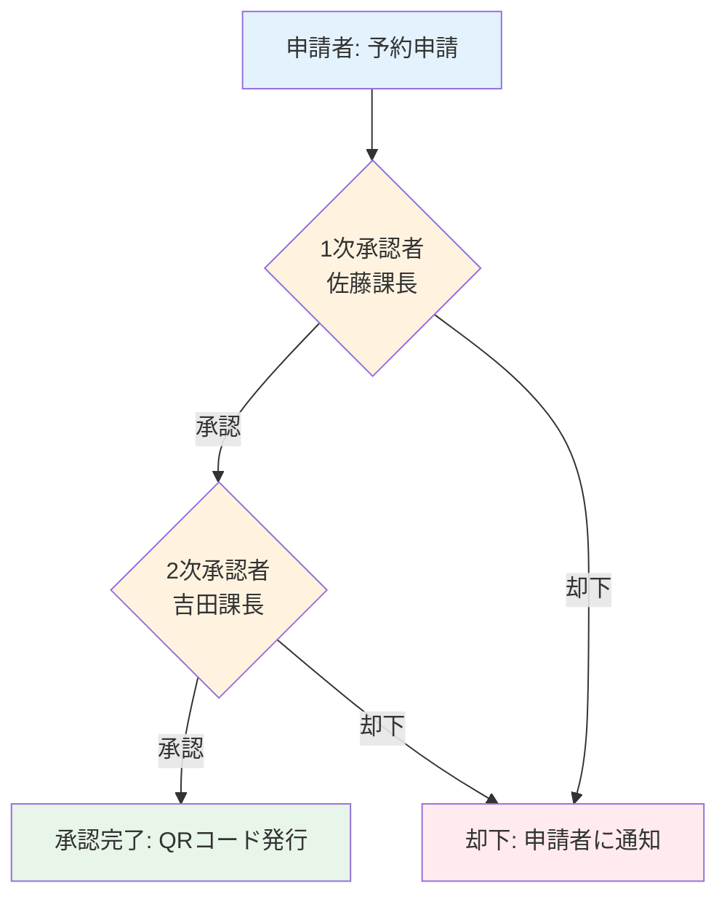

# 複数承認ワークフローのイメージ

## 概要
会議室予約において、複数の承認者による段階的な承認が必要な場合のワークフローです。

## ワークフロー図



## 承認フロー詳細

### ステップ1: 予約申請
**申請者（田中一郎）**
- 予約情報を入力
- 外部来訪者情報を登録
- 申請ボタンをクリック
- ステータス: `pending` → `pending_first_approval`

### ステップ2: 1次承認
**1次承認者（佐藤課長 - approver）**
- 承認待ちリストに表示
- 予約内容を確認
- 承認 or 却下を選択

**承認の場合:**
- ステータス: `pending_first_approval` → `pending_second_approval`
- 2次承認者に通知

**却下の場合:**
- ステータス: `pending_first_approval` → `rejected`
- 却下理由を入力
- 申請者に通知

### ステップ3: 2次承認
**2次承認者（吉田課長 - admin）**
- 承認待ちリストに表示
- 予約内容と1次承認情報を確認
- 最終承認 or 却下を選択

**承認の場合:**
- ステータス: `pending_second_approval` → `approved`
- QRコードを生成
- 全参加者にメール送信

**却下の場合:**
- ステータス: `pending_second_approval` → `rejected`
- 却下理由を入力
- 申請者に通知

## データ構造の拡張案

### Reservationインターフェース
```typescript
interface Reservation {
  id: string;
  // ... 既存フィールド
  status: 'pending_first_approval' | 'pending_second_approval' | 'approved' | 'rejected' | 'cancelled';
  approvalHistory?: {
    approver: string;      // 承認者名
    approverId: string;    // 承認者ID
    action: 'approved' | 'rejected';
    reason?: string;       // 却下理由
    timestamp: string;     // 承認/却下日時
  }[];
}
```

## UI表示例

### 承認者ダッシュボード
```
┌─ 承認待ち予約 ─────────────────────┐
│ 【1次承認待ち】                     │
│ ・田中一郎 - 会議室A 10:00-12:00   │
│   [承認] [却下]                     │
│                                     │
│ 【2次承認待ち】                     │
│ ・田中一郎 - 会議室B 14:00-16:00   │
│   1次承認: 佐藤課長 ✓              │
│   [承認] [却下]                     │
└─────────────────────────────────────┘
```

### 予約詳細表示
```
┌─ 予約詳細 ─────────────────────────┐
│ 会議室A 2026/01/10 10:00-12:00    │
│                                     │
│ 承認履歴:                           │
│ ✓ 1次承認: 佐藤課長                │
│   2026/01/07 14:30                 │
│                                     │
│ ⏳ 2次承認待ち: 吉田課長            │
└─────────────────────────────────────┘
```

## メリット
- ✅ 重要な予約の二重チェック
- ✅ 承認プロセスの透明性
- ✅ 責任の明確化
- ✅ 承認履歴の記録

## 注意点
- ⚠️ 承認に時間がかかる可能性
- ⚠️ 承認者不在時の代理承認ルールが必要
- ⚠️ 緊急時の承認スキップ機能の検討
